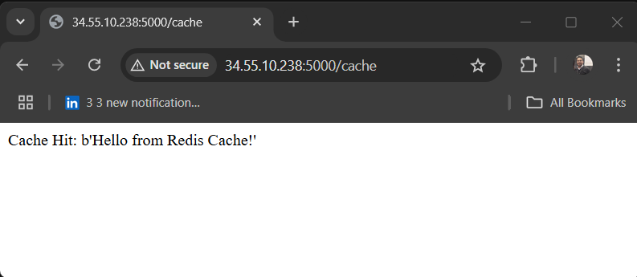

# Flask App with Database and Redis

This project demonstrates a Flask app that interacts with a PostgreSQL database and Redis. The application is containerized and deployed on Kubernetes using provided manifests. 

---

## Features
- **Flask**: Web application framework.
- **PostgreSQL**: Backend database for storing user data.
- **Redis**: Caching layer to improve performance.
- **Kubernetes**: Manages deployment, scaling, and availability.

---

## Prerequisites
- Kubernetes cluster
- Docker and Kubernetes CLI
- Google Cloud Registry (GCR) setup for storing Docker images
- [SOPS](https://github.com/mozilla/sops) for managing encrypted secrets (if applicable)

---

## Setup Instructions

### Step 1: Build and Push Docker Image
```bash
docker build -t gcr.io/cbd3354-435500/flask-app .
docker push gcr.io/cbd3354-435500/flask-app
```


---

### Step 2: Deploy Namespaces
```bash
kubectl create namespace database
kubectl create namespace flask
kubectl create namespace redis
```

---

### Step 3: Apply Secrets (Encoded files in repository)
#### Decoded Secrets (If you have the decoded files)
```bash
kubectl apply -f db-secret.yaml
kubectl apply -f flask-secret.yaml
```

#### Encoded Secrets (with SOPS)
Ensure the appropriate SOPS key is in your configuration, then:
```bash
sops -d db-secret.enc.yaml | kubectl apply -f -
sops -d flask-secret.enc.yaml | kubectl apply -f -
```

---

### Step 4: Apply ConfigMaps
```bash
kubectl apply -f db-configmap.yaml
kubectl apply -f flask-configmap.yaml
```

---

### Step 5: Deploy Components
```bash
kubectl apply -f redis-deployment.yaml
kubectl apply -f db-deployment.yaml
kubectl apply -f flask-deployment.yaml
```

---

### Step 6: Verify Deployments
Check if all resources are deployed correctly:
```bash
kubectl get all -n database -o wide
kubectl get all -n redis -o wide
kubectl get all -n flask -o wide
```

---

### Step 7: Initialize the Database
Once the database pod is running, populate it with initial data:
```bash
kubectl exec -i <POD-NAME> -n database -- bash
psql -h localhost -U flask -d mydb
```

Run the following SQL commands:
```sql
CREATE TABLE users (ID INT PRIMARY KEY NOT NULL, NAME TEXT NOT NULL);
INSERT INTO users VALUES (1, '3324_1');
```

---

## Application Features

### Endpoints
- `/`: Welcome message.
- `/users`: Retrieves all users from the database.
- `/cache`: Demonstrates caching with Redis.

### Sample Screenshots
Main Page:


Users Page:


Cache Example:


---

## Dependencies
The app requires the following Python packages (defined in `requirements.txt`):
- Flask
- psycopg2-binary
- redis
- Werkzeug

Install these locally for development:
```bash
pip install -r requirements.txt
```

---

## Known Issues
- Some network configurations block port `5000`. If you are using a remote cluster, you might not be able to access the app in the browser due to port blocking. Verify and update firewall or security group settings if necessary.
- Ensure Redis and PostgreSQL services are properly configured in the `ConfigMap`.
- Update the `Deployment` files with correct environment variables for production.
- **Note**: These instructions assume all files are in the same directory. If you cloned the repository with a directory structure, ensure you `cd` into the directory containing the `.yaml` file you are applying and return (`cd ..`) to the root for subsequent steps.
- **Note**: The secret files in the repository are encoded. It is recommended to generate your own decoded secret files.

---
